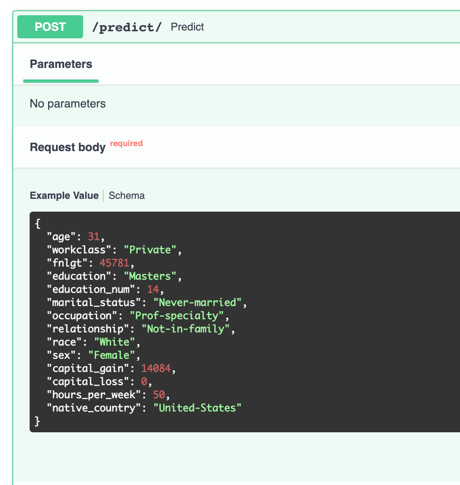

# Repositories
https://github.com/hoang-phuong-nguyen/udacity-p3-deploy-ml-model


# Environment Set up
Use the package manager [pip](https://pip.pypa.io/en/stable/) to install the dependencies from the ```requirements.txt```. Its recommended to install it in a separate virtual environment.

```bash
pip install -r requirements.txt
```

# Usage
1 - To run the model training and inference: 
```bash
./scripts/run_train.sh
```
2 - Test data slicing:
```bash
python starter/ml/data_slicing.py
```

3 - To run the unit test for the project: 
```bash
./scripts/unit_test.sh
```
- [test_model.py](./starter/ml/test_model.py): test data cleaning & model 
- [test_app.py](./test_app.py): test FastAPIs

4 - To deploy FastAPIs:
```bash
./scripts/run_APIs.sh
```

5 - Create a REST API:
```bash
http://127.0.0.1:8000/docs
```


6 - Query live API 


7 - Enable CI using Github Action when pushing a new commit
```bash
git push
```

8 - Enable CD on Render.com Cloud Platfom 
```bash
https://dashboard.render.com/
```


